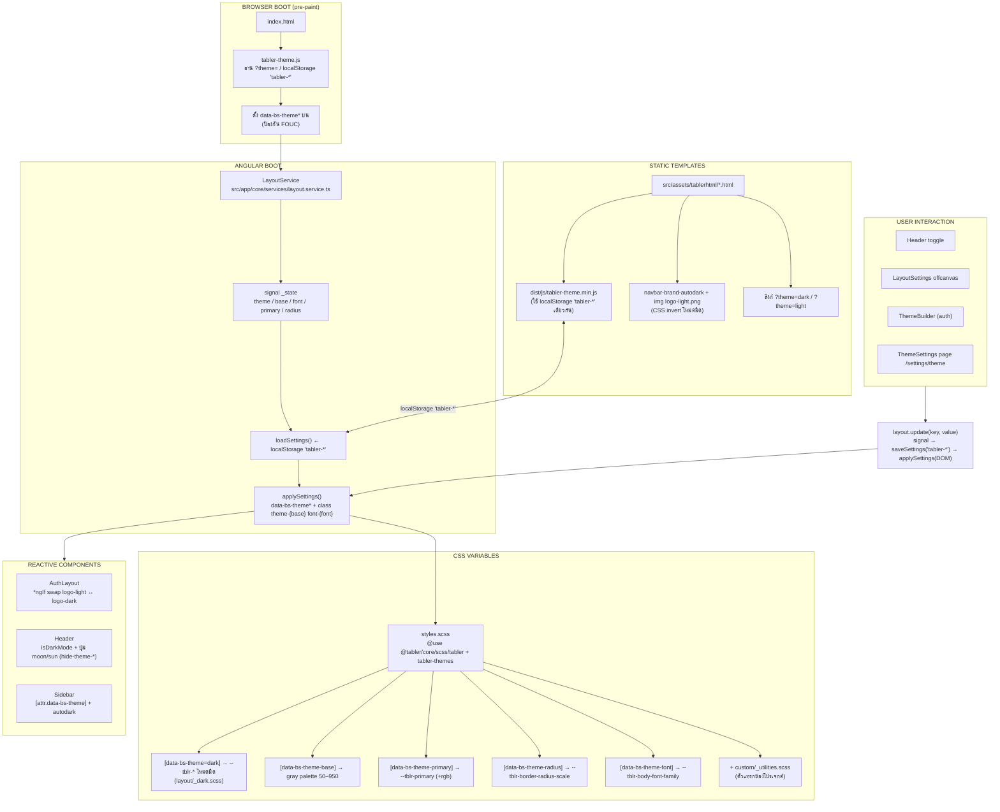

# Theme Architecture - แผนผังระบบธีมทั้งโครงการ

## ภาพรวม

ระบบธีมของโปรเจกต์อิงจาก **Tabler v1.4.0** ประกอบด้วย 2 โลกที่ทำงานคู่กัน:

1. **Angular app** — ควบคุมธีมผ่าน `LayoutService` (signals)
2. **Static templates** (`src/assets/tablerhtml/`) — self-contained ใช้ `dist/js/tabler-theme.min.js`

ทั้งสองโลกเชื่อมกันผ่าน **localStorage key `tabler-*`** และ `data-bs-theme*` attributes บน `<html>` จึง sync ธีมเดียวกันได้

## Mermaid Flowchart



## ข้อมูลสำคัญ

| รายการ | ตำแหน่ง | หมายเหตุ |
| --- | --- | --- |
| State store | `src/app/core/services/layout.service.ts` | signals 5 ค่า (theme/base/font/primary/radius) |
| Boot script | `node_modules/@tabler/core/dist/js/tabler-theme.js` | รันก่อน Angular, ป้องกัน FOUC |
| จุดเชื่อมสองโลก | localStorage key `tabler-*` | Angular + static templates อ่าน/เขียนชุดเดียวกัน |
| Settings UI | `layout-settings/*`, `theme-builder/*`, `theme-settings/*` | ตัวเลือก 5 กลุ่มเหมือนกันทั้ง 3 จุด |
| CSS | `src/styles.scss` → `@tabler/core/scss/{tabler,tabler-themes}` + `custom/_utilities.scss` | |
| Components ที่ผูกธีม | `auth-layout.component.html`, `header.component.{ts,html}`, `sidebar.component.html` | |

## ข้อสังเกต / Dead Code

- ธีมมีแค่ **light / dark** — ไม่มีโหมด auto (`prefers-color-scheme`)
- `src/assets/tabler/scss/` มี Tabler SCSS ทั้งชุดที่ **ไม่ถูก import** (dead weight) — มีเฉพาะ `custom/_utilities.scss` ที่ใช้จริง
- คีย์ i18n กลุ่ม layout (navbarDark, layoutMode, rtlMode ฯลฯ) ถูกนิยามไว้แต่ UI ยังไม่ใช้

## localStorage Keys

| Key | ใช้โดย | สถานะ |
| --- | --- | --- |
| `tabler-theme`, `tabler-theme-base`, `tabler-theme-font`, `tabler-theme-primary`, `tabler-theme-radius` | `LayoutService` + `tabler-theme.js` + static templates | ✅ ใช้งานจริง |
| `tablerMenuPosition/Behavior/ContainerLayout` | `preview/js/demo.js` (static templates) | เฉพาะ demo |

## Data Flow (ข้อความ)

```
[BROWSER BOOT]  tabler-theme.js → data-bs-theme* บน <html>
      ▼
[ANGULAR BOOT]  LayoutService → loadSettings('tabler-*') → applySettings(DOM)
      ▼
[CSS VARS]      [data-bs-theme*] selectors → --tblr-* variables
      ▼
[USER]          Header / LayoutSettings / ThemeBuilder / ThemeSettings
      ▼
                layout.update(key, value) → signal → saveSettings → applySettings
      ▼
[REACTIVE]      AuthLayout (logo swap) / Header (ปุ่ม moon-sun) / Sidebar
```
